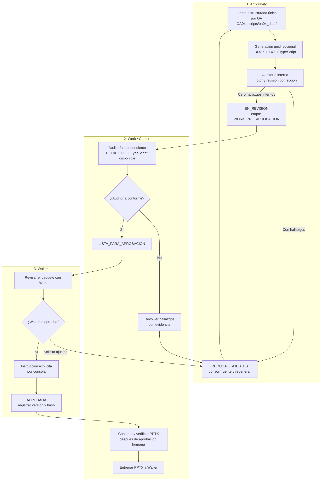

# Skill Oficial: Producción y Auditoría de Lecciones EstudioSimple (3° a 8° Básico)

Esta Skill establece las **reglas universales** y el **flujo general de producción pedagógica** para la creación, revisión y validación de lecciones en EstudioSimple para la totalidad de educación básica (3° a 8° básico). Los perfiles de curso y de asignatura agregan los criterios propios y específicos de su respectivo alcance. La Skill de coherencia ejecuta la auditoría utilizando estas reglas y perfiles oficiales; no debe crear criterios paralelos.

---

## 1. Declaración de Principios y Fuente Estructurada Única de Autoría

1. **Fuente Estructurada Única por OA:**
   Para cada Objetivo de Aprendizaje (OA), existe una **fuente estructurada única** definida por el proyecto (ej. `scripts/oa04_data/` para Matemática 7° OA04). Esta fuente estructurada contiene la totalidad de los datos didácticos, narrativas, reactivos psicométricos y prompts visuales.
2. **Generación Unidireccional Estricta:**
   El Plan Maestro oficial en DOCX (`Plan_Maestro_*.docx`), el guion TXT de prompts para Work y los módulos TypeScript interactivos en `Web Studio Simple/src/data/lessons/` se compilan o sincronizan **estrictamente en una sola dirección** a partir de dicha fuente estructurada.
   > 🛑 **PROHIBICIÓN TERMINANTE:** Queda estrictamente prohibido editar o parchear por separado los archivos derivados (DOCX, TXT o TypeScript). Toda modificación debe realizarse en la fuente estructurada única y propagarse mediante el script de construcción canónico.
3. **Rol de Presentaciones:**
   La carpeta `PLANES MAESTROS PRESENTACIONES/` es exclusivamente un catálogo de referencia visual para la maquetación en PowerPoint. Todo contenido didáctico emana de la lección oficial compilada desde la fuente estructurada.

---

## 2. Delimitación Estricta de Responsabilidades (Pipeline)



| Actor | Responsabilidad Obligatoria | Prohibiciones Estrictas |
| :--- | :--- | :--- |
| **Antigravity** | Mantener la fuente estructurada única, compilar unidireccionalmente el DOCX oficial, los prompts TXT y TypeScript, y ejecutar la auditoría interna automatizada con 0 hallazgos. Entregar el paquete en `EN_REVISION` (`WORK_PRE_APROBACION`). | **PROHIBIDO** generar o editar archivos PPTX finales. **PROHIBIDO** declarar `LISTA_PARA_APROBACION` o `APROBADA`. **PROHIBIDO** contar palabras o certificar duración acústica previa. |
| **Codex / ChatGPT Work** | **Fase Pre-Aprobación:** Auditar de forma independiente el flujo conceptual, redacción y correspondencia entre DOCX y TXT (PPTX aún no existe).<br>**Fase Post-Aprobación:** Construir y verificar visualmente las presentaciones PPTX en Python en su propio entorno tras la aprobación de Walter. | No modifica objetivos ni ejercicios aprobados en el DOCX sin retroalimentar a la fuente estructurada. |
| **Walter** | Máxima autoridad y **único aprobador humano**. Analiza el paquete con Work y emite la orden de aprobación explícitamente por consola. | No aplica. |
| **Google Vids** | Grabar, sintetizar locución, generar subtítulos y sincronizar la duración acústica real durante la producción del video. | Ni Antigravity ni Codex imponen restricciones acústicas previas. |

---

## 3. Jerarquía y Organización de Reglas por Alcance

Las directivas están estrictamente ordenadas por ámbito de aplicación en los recursos de la Skill:

1. **Alcance Universal (Transversal 3° a 8° Básico):**
   Ver [rules/reglas_universales.md](rules/reglas_universales.md).
   - Estructura pedagógica de 8 etapas duales (Mentor / Estudiante).
   - **Parámetro Estándar de Cobertura por OA:** Exactamente **6 lecciones completas por Objetivo de Aprendizaje (OA)** (Directriz Work).
   - **Fuente Estructurada Única por OA:** Compilación unidireccional estricta hacia DOCX, TXT y TypeScript.
   - **Identidad de Ejercicios en 5 Dimensiones:** Contexto, datos y unidades, pregunta/intención, procedimiento esperado, respuesta correcta/retroalimentación, enlazando `caso1` y `caso2` entre práctica, D6 y `postQuestions`.
   - Todas las reglas universales (`UNI-001` a `UNI-015`) clasificadas como **BLOQUEANTES**.
   - Blindaje terminante anti-texto en arte IA (`No text drawn by AI`).
   - Puente análogo-digital con el cuaderno físico.
   - Honestidad epistemológica (atribución a fuentes oficiales).
   - Evaluación formativa sin marcas punitivas.

2. **Alcance por Curso y Nivel Evolutivo:**
   - **3° y 4° Básico (Primer Ciclo):** [profiles/cursos/perfil_3_4_basico.md](profiles/cursos/perfil_3_4_basico.md).
   - **5° y 6° Básico (Transición):** [profiles/cursos/perfil_5_6_basico.md](profiles/cursos/perfil_5_6_basico.md).
   - **7° Básico (Segundo Ciclo):** [profiles/cursos/perfil_7_basico.md](profiles/cursos/perfil_7_basico.md) (**Específico de 7°**: Estructura bimodal de 14 láminas [7 Gancho + 7 Explicación], protagonistas de 13 años [joven con trenzas y joven con chaqueta cerceta], y reactivos de 4 alternativas [A, B, C, D] con análisis psicométrico formal de distractores).
   - **8° Básico (Consolidación):** [profiles/cursos/perfil_8_basico.md](profiles/cursos/perfil_8_basico.md).
   *Nota Crítica:* Los requisitos de 14 láminas, 4 alternativas A-D y 13 años son específicos de 7° básico y **no deben generalizarse como universales**.

3. **Alcance por Asignatura:**
   - **Matemática:** [profiles/asignaturas/matematica.md](profiles/asignaturas/matematica.md) (Enfoque CPA, resolución Pólya, fórmula canónica $p\% = p \div 100$, subtítulos en 36 pt y progresión de OA04 Porcentajes).
   - **Ciencias Naturales:** [profiles/asignaturas/ciencias_naturales.md](profiles/asignaturas/ciencias_naturales.md) (Indagación científica empírica, subtítulos en 48 pt).
   - **Lengua y Literatura:** [profiles/asignaturas/lengua_literatura.md](profiles/asignaturas/lengua_literatura.md) (Comprensión multinivel, subtítulos en 48 pt).
   - **Historia, Geografía y Cs. Sociales:** [profiles/asignaturas/historia_geografia.md](profiles/asignaturas/historia_geografia.md) (Pensamiento histórico, erradicación de jerga matemática, subtítulos en 48 pt).
   - **Inglés (EFL):** [profiles/asignaturas/ingles.md](profiles/asignaturas/ingles.md) (Enfoque comunicativo funcional, subtítulos en 48 pt).

4. **Alcance por OA Específico:**
   - Alineación obligatoria con `TEMARIOS EELL/` y el texto escolar respectivo.
   - Si una fuente no está disponible en el disco local, se registra como **"no evaluable"**.

---

## 4. Flujo de Trabajo Obligatorio de 12 Pasos por OA

Cada vez que se cree o revise una lección, se debe ejecutar estrictamente este protocolo:

1. **Identificar:** Definir curso, asignatura, OA y verificar la existencia de fuentes oficiales aplicables.
2. **Definir Fuente Única:** Configurar o actualizar el módulo de datos en `scripts/oaXX_data/`.
3. **Comprobar Alineación en 5 Dimensiones:** Validar contexto, datos, pregunta, procedimiento y respuesta entre práctica, video explicativo y post-questions.
4. **Verificar Cálculos y Notación:** Asegurar que los procedimientos matemáticos y citas sean científicamente intachables.
5. **Articulación de Práctica:** Confirmar que la lección prepare de forma directa y genuina para la práctica interactiva posterior de la plataforma.
6. **Cierre sin Desafío Redundante:** Asegurar que la lámina final concluya con la Regla de Oro y pase directo a la plataforma interactiva.
7. **Reutilización Fiel de Ejercicios:** La revisión posterior al video (`postQuestions`) debe reutilizar exactamente `caso1` y `caso2` de la práctica.
8. **Compilación Unidireccional:** Ejecutar el script `build_<asignatura>_<oa>_package.ts` para regenerar DOCX, TXT y TypeScript.
9. **Ubicación Canónica y Timestamp:** Guardar el paquete en `LECCIONES/110-<curso>/<Asignatura>/<OA>/` con timestamp en `America/Santiago`.
10. **Auditoría Interna Determinista:** Ejecutar `audit_coherence_engine.ts` hasta obtener 0 hallazgos (certifica únicamente la auditoría interna).
11. **Entrega a Work:** Publicar el paquete en estado `EN_REVISION` con `"etapa_revision": "WORK_PRE_APROBACION"`.
12. **Aprobación Humana Exclusiva:** Solo tras la revisión independiente de Work/Codex y la orden expresa de Walter por consola, transicionar a `APROBADA`.

---

## 5. Ciclo de Vida y Estados Canónicos del Manifiesto

En `manifest.json`, el campo `status` transita estrictamente a través de 5 estados:

```
[BORRADOR] ──► [EN_REVISION] ──(Auditoría interna: 0 hallazgos)──► [EN_REVISION (WORK_PRE_APROBACION)]
                     │                                                          │
             (Si hay brechas)                                           (Auditoría Work)
                     ▼                                                          ▼
             [REQUIERE_AJUSTES] ◄──────────────────────────────────── [LISTA_PARA_APROBACION]
                                                                                │
                                                                   (Instrucción Walter en consola)
                                                                                ▼
                                                                           [APROBADA]
```

- `BORRADOR`: En desarrollo en la fuente estructurada de datos.
- `EN_REVISION`: Paquete compilado en proceso de verificación. Con 0 hallazgos en la auditoría interna de Antigravity, se registra `"etapa_revision": "WORK_PRE_APROBACION"`.
- `REQUIERE_AJUSTES`: Se identificaron brechas en la auditoría interna o por Work.
- `LISTA_PARA_APROBACION`: Declarado **únicamente después** de que Work/Codex concluye su auditoría independiente del contenido sin observaciones. Prohibido aplicar este estado de forma autónoma por Antigravity.
- `APROBADA`: Declarado **exclusivamente por Walter** por consola tras el análisis conjunto con Work.

> 🕒 **TRAZABILIDAD TEMPORAL OBLIGATORIA (FECHA Y HORA EN NOMBRE DE ARCHIVO Y CONTENIDO):**
> Todo archivo de plan de lecciones generado o modificado (DOCX oficial y TXT de prompts para Work) DEBE incorporar obligatoriamente la fecha y hora exacta en el propio **nombre del archivo** (formato `..._YYYY-MM-DD_HH-mm.docx` y `..._YYYY-MM-DD_HH-mm.txt`, zona horaria de Chile `America/Santiago`), así como en sus portadas, cabeceras internas y `manifest.json` (`YYYY-MM-DD HH:mm [America/Santiago]`). Al generarse una nueva versión, se elimina y reemplaza el archivo antiguo por el nuevo en su carpeta canónica, dejando estrictamente el archivo más actualizado con su estampa temporal para evitar acumulación de versiones obsoletas.
