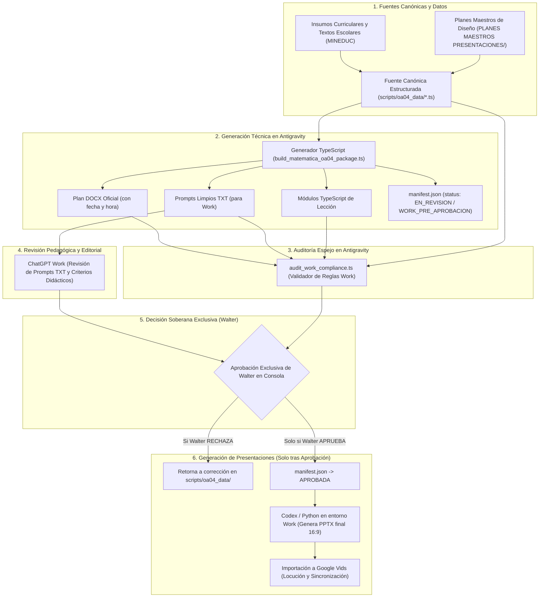

# ANTIGRAVITY — FASE 0: INVENTARIO VERIFICABLE DEL SISTEMA ESTUDIOSIMPLE (RECTIFICADO)
**Fecha y hora:** 2026-10-08 20:11 (America/Santiago)  
**Estado:** Inspección Finalizada y Rectificada (Solo Lectura)  

---

## A. Estado del entorno

### 1. Parámetros del espacio de trabajo
- **Ruta absoluta de inspección:** `d:\StudioSimple - Antigravity`
- **Sistema operativo y Shell:** Windows (`win32 10.0.26100`), PowerShell (`pwsh`)
- **Control de versiones:** Git
  - **Rama activa:** `main`
  - **Último commit registrado:** `6142913` (*fix(audit): refine auditor rules to mirror work spec exactly and add docx text parity check*)
  - **Estado del árbol de trabajo (`git status --short`):**
    - Archivos rastreados (*tracked*): Limpio, sin modificaciones pendientes.
    - Archivos no rastreados (*untracked*): 
      - `scripts/audit_work_compliance.ts` (Auditor de cumplimiento espejo de Work creado durante la fase de análisis).
      - `scripts/deep_audit_docx.ts` (Script de inspección interna de DOCX generado en fases previas).
      - `scripts/inspect_docx.ts` (Script de lectura de párrafos de DOCX).

### 2. Información y recursos no disponibles en el entorno local
1. **Carpeta `PRESENTACIONES PARA VIDEOS`:** No existe en la raíz `d:\StudioSimple - Antigravity`, ni en la unidad `D:\`, ni en carpetas de usuario locales (`C:\Users\walte\Downloads`, `Desktop`, `Documents`).
2. **Archivos `SKILL(1).md` hasta `SKILL(9).md`:** No existen localmente en ninguna ruta accesible del sistema de archivos. Marcados formalmente como **`NO INSPECCIONADOS`**.
3. **Sexta Asignatura respaldada:** No se encontró evidencia documental, curricular ni en base de datos de una sexta asignatura para 7.° básico. Solo existen cinco asignaturas identificadas con evidencia en el repositorio.

---

## B. Inventario de las seis asignaturas

### 1. Alcance oficial fijado por la dirección del proyecto
- **Asignaturas requeridas por el proyecto:** **6** (alcance oficial de EstudioSimple para 7.° Básico).
- **Asignaturas identificadas con evidencia en el repositorio:** **5**.
- **Sexta asignatura:** **`NO IDENTIFICADA EN LAS FUENTES REVISADAS`**.

> [!IMPORTANT]
> **Delimitación conceptual y retiro de hipótesis:**
> - Se retira formalmente la hipótesis no respaldada que atribuía la mención de "seis asignaturas" a los "seis paquetes de OA". Dicha interpretación contradecía el alcance establecido por Walter.
> - Se distingue la lista oficial de exámenes libres del MINEDUC (que evalúa cinco sectores: Lenguaje, Matemática, Ciencias Naturales, Historia e Inglés) del alcance ampliado de cobertura pedagógica de EstudioSimple, que define **seis asignaturas**.
> - Se registra como **brecha pendiente de insumos** la identificación del nombre oficial, planes maestros y fuentes curriculares de la 6.ª asignatura del proyecto.

### 2. Tabla de asignaturas y evidencias

| N.° | Asignatura | Estado en proyecto | Plan Maestro encontrado | Versión y fecha visible en carátula / archivo | Archivo de Skill disciplinar | Fuentes de contenido estructurado / canónico | Evidencia de ubicación en repositorio |
| :---: | :--- | :---: | :--- | :--- | :--- | :--- | :--- |
| **1** | **Ciencias Naturales** | Identificada | `Plan_Maestro_EstudioSimple_Ciencias_Naturales_7B_v1.4_2026-10-03_1538_UTC-0300.docx` | v1.4 (2026-10-03 15:38 UTC-0300) | `.agents/skills/expert_ciencias_naturales/SKILL.md` | `scripts/build_ciencias_oa01_package.ts`, Texto Mineduc Santillana 7° Básico | `LECCIONES/110-7/Ciencias_Naturales/110-7-CIE-OA01` |
| **2** | **Historia, Geografía y Ciencias Sociales** | Identificada | `Plan_Maestro_EstudioSimple_Historia_Geografia_Ciencias_Sociales_7B_v1.4_2026-10-03_1538_UTC-0300.docx` | v1.4 (2026-10-03 15:38 UTC-0300) | `.agents/skills/expert_historia_ciencias_sociales/SKILL.md` | `scripts/build_historia_oa02_package.ts`, Texto Mineduc SM 7° Básico | `LECCIONES/110-7/Historia_Geografia_Ciencias_Sociales/110-7-HIS-OA02` |
| **3** | **Inglés** | Identificada | `Plan_Maestro_EstudioSimple_Ingles_7B_v1.8_2026-10-03_1538_UTC-0300.docx` | v1.8 (2026-10-03 15:38 UTC-0300) | `.agents/skills/expert_ingles/SKILL.md` | `scripts/build_all_7b_packages.ts`, Texto Mineduc Richmond Fast Track 7° Básico | `LECCIONES/110-7/Ingles/110-7-ING-OA09` |
| **4** | **Lengua y Literatura** | Identificada | `Plan_Maestro_EstudioSimple_Lengua_Literatura_7B_v2.6_2026-10-03_1538_UTC-0300.docx` | v2.6 (2026-10-03 15:38 UTC-0300) | `.agents/skills/expert_lenguaje_literatura/SKILL.md` | `scripts/build_all_7b_packages.ts`, Texto Mineduc SM 7° Básico | `LECCIONES/110-7/Lengua_Literatura/110-7-LEN-OA03` |
| **5** | **Matemática** | Identificada | `Plan_Maestro_EstudioSimple_Matematica_7B_v1.4_2026-10-03_1538_UTC-0300.docx` | v1.4 (2026-10-03 15:38 UTC-0300) | `.agents/skills/expert_matematica/SKILL.md` | `scripts/oa04_data/` (OA04), `scripts/build_matematica_oa04_package.ts`, Texto Mineduc Santillana 7° Básico | `LECCIONES/110-7/Matematica/110-7-MAT-OA01` y `LECCIONES/110-7/Matematica/110-7-MAT-OA04` |
| **6** | **6.ª Asignatura** | **Requerida (Pendiente de identificación)** | *No encontrada en repositorio* | Sin evidencia | Sin evidencia | Sin evidencia | **BRECHA REGISTRADA:** Pendiente definir nombre y fuentes oficiales |

---

## C. Inventario de skills

### 1. Habilidades en carpeta de referencia `PRESENTACIONES PARA VIDEOS` (`SKILL(1).md` a `SKILL(9).md`)
Conforme a la regla estricta de no deducir contenido por nombre y registrar falta de acceso:

| Archivo | Ruta esperada | Estado | Evidencia |
| :--- | :--- | :---: | :--- |
| `SKILL(1).md` | `PRESENTACIONES PARA VIDEOS/SKILL(1).md` | **NO INSPECCIONADO** | Carpeta y archivo inexistentes en el entorno local. |
| `SKILL(2).md` | `PRESENTACIONES PARA VIDEOS/SKILL(2).md` | **NO INSPECCIONADO** | Carpeta y archivo inexistentes en el entorno local. |
| `SKILL(3).md` | `PRESENTACIONES PARA VIDEOS/SKILL(3).md` | **NO INSPECCIONADO** | Carpeta y archivo inexistentes en el entorno local. |
| `SKILL(4).md` | `PRESENTACIONES PARA VIDEOS/SKILL(4).md` | **NO INSPECCIONADO** | Carpeta y archivo inexistentes en el entorno local. |
| `SKILL(5).md` | `PRESENTACIONES PARA VIDEOS/SKILL(5).md` | **NO INSPECCIONADO** | Carpeta y archivo inexistentes en el entorno local. |
| `SKILL(6).md` | `PRESENTACIONES PARA VIDEOS/SKILL(6).md` | **NO INSPECCIONADO** | Carpeta y archivo inexistentes en el entorno local. |
| `SKILL(7).md` | `PRESENTACIONES PARA VIDEOS/SKILL(7).md` | **NO INSPECCIONADO** | Carpeta y archivo inexistentes en el entorno local. |
| `SKILL(8).md` | `PRESENTACIONES PARA VIDEOS/SKILL(8).md` | **NO INSPECCIONADO** | Carpeta y archivo inexistentes en el entorno local. |
| `SKILL(9).md` | `PRESENTACIONES PARA VIDEOS/SKILL(9).md` | **NO INSPECCIONADO** | Carpeta y archivo inexistentes en el entorno local. |

---

### 2. Recuento de skills locales en `.agents/skills/` (por archivo físico independiente)

- **Total de skills funcionales independientes:** **15**
- **Alias / duplicados físicos:** **1** (`.agents/skills/ui/ux_expert/SKILL.md` es un clon idéntico de 3.414 bytes de `frontend_design_expert/SKILL.md`).

| N.° | Nombre de la Skill | Ruta relativa de archivo | Propósito comprobado en contenido | Alcance | Entradas | Salidas | Dependencias |
| :---: | :--- | :--- | :--- | :--- | :--- | :--- | :--- |
| **1** | `estudiosimple-lecciones` | `.agents/skills/estudiosimple-lecciones/SKILL.md` | Orquestar flujo canónico de 12 pasos para generar lecciones, DOCX y prompts para Work. | Común (3° a 8°) | Temarios EELL, textos escolares, datos estructurados. | Paquetes en `LECCIONES/`, DOCX oficial, TXT, TS, `manifest.json`. | Skills disciplinares, `curriculum_mineduc_expert`, `docx`. |
| **2** | `auditor_coherencia_estudiosimple` | `.agents/skills/auditor_coherencia_estudiosimple/SKILL.md` | Auditoría de coherencia curricular entre Planes Maestros, DOCX y código TS. | Común (Transversal) | DOCX oficial, `manifest.json`, archivos `.ts`. | Reporte markdown, diagnósticos de coherencia. | `scripts/audit_coherence_engine.ts`, `mammoth`. |
| **3** | `curriculum_mineduc_expert` | `.agents/skills/curriculum_mineduc_expert/SKILL.md` | Alineación con Bases Curriculares y Temarios EELL MINEDUC. | Común (Transversal) | Temarios EELL, decretos MINEDUC. | Matrices curriculares, cobertura de OAs. | Ninguna externa. |
| **4** | `instructional_design_expert` | `.agents/skills/instructional_design_expert/SKILL.md` | Diseño instruccional para homeschooling, mediación y puente análogo-digital con cuaderno. | Común (Transversal) | Contenidos curriculares, guía del apoderado. | Estructura de 8 etapas didácticas duales, plantillas físicas. | Ninguna externa. |
| **5** | `assessment_evaluation_expert` | `.agents/skills/assessment_evaluation_expert/SKILL.md` | Psicometría formativa, reactivos MINEDUC con 4 alternativas (A-D) y distractores fundamentados. | Común (Transversal) | Objetivos de aprendizaje, conceptos clave. | Reactivos de práctica, preguntas metacognitivas. | Ninguna externa. |
| **6** | `educational_expert` | `.agents/skills/educational_expert/SKILL.md` | Principios pedagógicos generales, taxonomía de Bloom y andamiaje cognitivo. | Común (Transversal) | Requerimientos didácticos generales. | Orientaciones pedagógicas, tono motivador. | Ninguna externa. |
| **7** | `gamification_simulators_expert` | `.agents/skills/gamification_simulators_expert/SKILL.md` | Mecánicas de gamificación no invasivas y simuladores interactivos para neurodivergentes. | Común (Transversal) | Ejercicios interactivos de plataforma. | Especificaciones de simuladores (Canvas/React). | React, Canvas. |
| **8** | `expert_ciencias_naturales` | `.agents/skills/expert_ciencias_naturales/SKILL.md` | Didáctica de Ciencias Naturales 7° y 8° básico: indagación científica y evidencia. | Asignatura (Ciencias) | Texto oficial Santillana 7° Básico, Temario EELL. | Contenidos y experimentos para paquetes de Ciencias. | `curriculum_mineduc_expert`. |
| **9** | `expert_historia_ciencias_sociales` | `.agents/skills/expert_historia_ciencias_sociales/SKILL.md` | Didáctica de Historia y Geografía 7° y 8° básico: pensamiento histórico y análisis de fuentes. | Asignatura (Historia) | Texto oficial SM 7° Básico, Temario EELL. | Contenidos, fuentes primarias y secundarias. | `curriculum_mineduc_expert`. |
| **10** | `expert_ingles` | `.agents/skills/expert_ingles/SKILL.md` | Didáctica de Inglés (EFL) 7° y 8° básico: enfoque comunicativo funcional y lenguaje en contexto. | Asignatura (Inglés) | Texto Richmond Fast Track 7° Básico, Temario EELL. | Diálogos, prompts auditivos y vocabulario funcional. | `curriculum_mineduc_expert`. |
| **11** | `expert_lenguaje_literatura` | `.agents/skills/expert_lenguaje_literatura/SKILL.md` | Didáctica de Lengua y Literatura 7° y 8° básico: comprensión multinivel y enriquecimiento léxico. | Asignatura (Lenguaje) | Texto oficial SM 7° Básico, Temario EELL. | Textos literarios/no literarios, estrategias de lectura. | `curriculum_mineduc_expert`. |
| **12** | `expert_matematica` | `.agents/skills/expert_matematica/SKILL.md` | Didáctica de Matemática 7° y 8° básico: enfoque Concreto-Pictórico-Simbólico (CPA). | Asignatura (Matemática) | Texto oficial Santillana 7° Básico, Temario EELL. | Modelamientos CPA, resolución guiada de problemas. | `curriculum_mineduc_expert`. |
| **13** | `frontend_design_expert` | `.agents/skills/frontend_design_expert/SKILL.md` | Diseño visual frontend web: Glassmorphism, Tailwind CSS, micro-animaciones. | Común (Técnico Web) | Requerimientos de UI web de la plataforma. | Componentes React/HTML, CSS tokens. | Tailwind CSS, Lucide icons. |
| **14** | `neon_db_expert` | `.agents/skills/neon_db_expert/SKILL.md` | Arquitectura y optimización de base de datos PostgreSQL Serverless con Neon y Prisma. | Común (Técnico Backend) | Modelos Prisma, consultas SQL. | Esquemas, migraciones y optimizaciones de conexión. | `@neondatabase/serverless`, Prisma. |
| **15** | `railway_devops` | `.agents/skills/railway_devops/SKILL.md` | Despliegue continuo y orquestación de servicios en Railway. | Común (Técnico DevOps) | Dockerfile, variables de entorno, configuración Railway. | Pipelines CI/CD operativos, monitorización de logs. | Railway CLI. |
| *Alias* | *`ui/ux_expert`* | `.agents/skills/ui/ux_expert/SKILL.md` | *Duplicado físico exacto (clon) de `frontend_design_expert/SKILL.md`.* | *Común (Técnico Web)* | *Mismos de frontend_design_expert.* | *Mismos de frontend_design_expert.* | *frontend_design_expert.* |

---

## D. Inventario del sistema técnico y de contenidos

### 1. Fuentes canónicas estructuradas
- **`scripts/oa04_data/types.ts`:**
  - Define interfaces TypeScript: `OA04LessonData`, `SlideContent`, `HookData`, `FormalizationData`, `PracticeExercise`, `MetacognitiveQuestion`.
  - Especificaciones fijas: formato `16:9 widescreen`, estilo visual, capa vectorial y logotipo blanco en esquina inferior derecha.
- **`scripts/oa04_data/clase01.ts` a `clase06.ts`:**
  - Datos íntegros y estructurados de las 6 clases de Matemática 7.° OA04.
  - Cada archivo contiene exactamente 14 láminas (7 Gancho + 7 Explicación), totalizando 84 láminas en el OA.

### 2. Generadores de artefactos y análisis de atomicidad

#### `scripts/build_matematica_oa04_package.ts`
- **Archivos leídos:**
  - *Fuentes canónicas:* `scripts/oa04_data/clase01.ts` a `clase06.ts`, `scripts/oa04_data/types.ts`.
  - *Archivos de la aplicación:* `Web Studio Simple/src/data/lessons/index.ts`, `Web Studio Simple/src/lib/lesson-repository.ts`.
  - *Directorio de salida:* `LECCIONES/110-7/Matematica/OA04/` (lectura para depurar versiones antiguas).
- **Archivos escritos o actualizados (Total: 11 archivos):**
  - *En carpeta de entrega curricular (`LECCIONES/110-7/Matematica/OA04/`):*
    1. `Plan_Maestro_7Básico_110-7-MAT-OA04_6Lecciones_${fileTimestamp}.docx` (DOCX oficial).
    2. `Prompts_Work_Matematica_7B_OA04_${fileTimestamp}.txt` (Prompts limpios para Work).
    3. `manifest.json` (Metadatos y estado normativo).
  - *En aplicación web (`Web Studio Simple/`):*
    4 al 9. `src/data/lessons/matematica_7b_oa04_clase01.ts` a `clase06.ts` (6 módulos TypeScript individuales).
    10. `src/data/lessons/index.ts` (actualización de exports).
    11. `src/lib/lesson-repository.ts` (actualización de fábrica de lecciones).
- **Atomicidad:** **NO ATÓMICO**. En Node.js, `fs.writeFileSync` ejecuta escrituras secuenciales e independientes en el sistema de archivos; si el proceso se interrumpe, no existe transacción de reversión (*rollback*).

#### `scripts/build_ciencias_oa01_package.ts`
- **Archivos leídos:** `Web Studio Simple/src/data/lessons/ciencias_7b_oa01_clase01.ts` a `clase06.ts`.
- **Archivos escritos o actualizados (Total: 10 archivos):** DOCX, TXT y `manifest.json` en `LECCIONES/110-7/Ciencias_Naturales/OA01/`, 6 archivos `.ts` modificados en `Web Studio Simple/src/data/lessons/`, y sincronización de 2 archivos JSON en `Web Studio Simple/public/data/`.
- **Atomicidad:** **NO ATÓMICO**.

#### `scripts/build_historia_oa02_package.ts`
- **Archivos leídos:** `Web Studio Simple/src/data/lessons/historia_7b_oa02_clase01.ts` a `clase06.ts`, `Web Studio Simple/public/data/curriculum_catalog.json`.
- **Archivos escritos (Total: 3 archivos):** DOCX, TXT y `manifest.json` en `LECCIONES/110-7/Historia_Geografia/OA02/`.
- **Atomicidad:** **NO ATÓMICO**.

#### `scripts/build_all_7b_packages.ts`
- **Archivos leídos:** `Web Studio Simple/public/data/curriculum_catalog.json`, `Web Studio Simple/src/data/lessons/index.ts`.
- **Archivos escritos (Total: 18 archivos):** DOCX, TXT y `manifest.json` para los 6 paquetes configurados (`MAT-OA01`, `CIE-OA01`, `HIS-OA02`, `LEN-OA03`, `ING-OA09`, `MAT-OA04`).
- **Atomicidad:** **NO ATÓMICO**.

### 3. Validadores y auditores

#### `scripts/audit_work_compliance.ts`
- **Función comprobada en código fuente:**
  - Audita las 84 láminas de `scripts/oa04_data/` (14 láminas por clase).
  - Títulos: máximo **6 palabras** según tokenización de Work (líneas 499-513 y 631-645).
  - Subtítulos: máximo **8 palabras** según tokenización de Work (líneas 520-534 y 652-666). Resultado: **`CUMPLE`** con la regla oficial de Work.
  - Prompts visuales: detecta duplicaciones de protagonistas (`PRM-002`) y números/operaciones prohibidas (`PRM-004`).
  - Suite de auto-prueba (`--self-test`): ejecuta 5 pruebas unitarias sintéticas con código de salida `0`.
  - Ejecución completa sobre `scripts/oa04_data/`: código de salida `1` (detecta reproduciblemente los **25 hallazgos**).

---

## E. Mapa del flujo y gobernanza obligatoria

El orden jerárquico inquebrantable de gobernanza es:  
**Revisión de Work ➔ Decisión exclusiva de Walter ➔ Solo si Walter aprueba, generación de PPTX por Codex.**

> [!CAUTION]
> **Estado de OA04:** Permanece estrictamente en **`EN_REVISION / WORK_PRE_APROBACION`**. Bajo ninguna circunstancia se generará ni modificará presentación PPTX antes de que Walter otorgue su aprobación en consola tras analizar los insumos con Work.

---

## F. Brechas y evidencias reproducibles

### 1. Tabla reproducible de los 25 hallazgos de OA04
- **Comando ejecutado:** `npx tsx scripts/audit_work_compliance.ts`
- **Código de salida:** `1` (Falla)
- **Archivo inspeccionado:** `scripts/oa04_data/clase01.ts` a `clase06.ts`

| N.° | Clase | Momento | Lámina | Campo exacto en fuente | Valor actual detectado | Regla incumplida |
| :---: | :---: | :---: | :---: | :--- | :--- | :--- |
| **1** | Clase 1 | Explicación | Lámina 7 | `formalization.slides[6].visualPrompt` | Protagonistas repetidos 2 veces en el mismo campo | `PRM-002` (Cero duplicación de protagonistas) |
| **2** | Clase 2 | Gancho | Lámina 6 | `hook.slides[5].visualPrompt` | Contiene `"20%"` | `PRM-004` (Cero operaciones/datos numéricos) |
| **3** | Clase 2 | Explicación | Lámina 6 | `formalization.slides[5].visualPrompt` | Contiene `"20%"` | `PRM-004` (Cero operaciones/datos numéricos) |
| **4** | Clase 3 | Gancho | Lámina 2 | `hook.slides[1].visualPrompt` | Contiene `"50 percent"`, `"8000 pesos"` | `PRM-004` (Cero operaciones/datos numéricos) |
| **5** | Clase 3 | Gancho | Lámina 3 | `hook.slides[2].visualPrompt` | Contiene `"25 percent"` | `PRM-004` (Cero operaciones/datos numéricos) |
| **6** | Clase 3 | Gancho | Lámina 4 | `hook.slides[3].overlayTitle` | `"10% ES DIVIDIR POR 10 \| 20% ES DIVIDIR POR 5"` (10 palabras) | `TIT-001` (Máximo 6 palabras en Título) |
| **7** | Clase 3 | Gancho | Lámina 4 | `hook.slides[3].visualPrompt` | Contiene `"10 percent"` | `PRM-004` (Cero operaciones/datos numéricos) |
| **8** | Clase 3 | Gancho | Lámina 6 | `hook.slides[5].visualPrompt` | Contiene `"20%"`, `"150 pages"` | `PRM-004` (Cero operaciones/datos numéricos) |
| **9** | Clase 3 | Explicación | Lámina 4 | `formalization.slides[3].visualPrompt` | Contiene `"10%"`, `"20%"` | `PRM-004` (Cero operaciones/datos numéricos) |
| **10** | Clase 3 | Explicación | Lámina 7 | `formalization.slides[6].visualPrompt` | Protagonistas repetidos 2 veces en el mismo campo | `PRM-002` (Cero duplicación de protagonistas) |
| **11** | Clase 4 | Gancho | Lámina 1 | `hook.slides[0].visualPrompt` | Contiene `"500 liters"` | `PRM-004` (Cero operaciones/datos numéricos) |
| **12** | Clase 4 | Gancho | Lámina 2 | `hook.slides[1].overlayTitle` | `"¿Y SI NO HAY UN ATAJO DIRECTO?"` (7 palabras) | `TIT-001` (Máximo 6 palabras en Título) |
| **13** | Clase 4 | Gancho | Lámina 2 | `hook.slides[1].visualPrompt` | Contiene `"18%"` | `PRM-004` (Cero operaciones/datos numéricos) |
| **14** | Clase 4 | Gancho | Lámina 3 | `hook.slides[2].visualPrompt` | Contiene `"0.18"` | `PRM-004` (Cero operaciones/datos numéricos) |
| **15** | Clase 4 | Gancho | Lámina 5 | `hook.slides[4].visualPrompt` | Contiene `"calculations arriving at 90"` | `PRM-004` (Cero operaciones/datos numéricos) |
| **16** | Clase 4 | Gancho | Lámina 6 | `hook.slides[5].visualPrompt` | Contiene `"35%"`, `"40 students"` | `PRM-004` (Cero operaciones/datos numéricos) |
| **17** | Clase 4 | Explicación | Lámina 3 | `formalization.slides[2].overlayTitle` | `"CUIDADO CON LOS PORCENTAJES MENORES A 10%"` (7 palabras) | `TIT-001` (Máximo 6 palabras en Título) |
| **18** | Clase 4 | Explicación | Lámina 3 | `formalization.slides[2].visualPrompt` | Contiene `"8%"`, `"250 x 0.08"`, `"0.08"` | `PRM-004` (Cero operaciones/datos numéricos) |
| **19** | Clase 4 | Explicación | Lámina 4 | `formalization.slides[3].visualPrompt` | Contiene `"2x2"` | `PRM-004` (Cero operaciones/datos numéricos) |
| **20** | Clase 4 | Explicación | Lámina 7 | `formalization.slides[6].visualPrompt` | Protagonistas repetidos 2 veces en el mismo campo | `PRM-002` (Cero duplicación de protagonistas) |
| **21** | Clase 5 | Gancho | Lámina 1 | `hook.slides[0].overlayTitle` | `"DESCUENTOS E IVA EN LA VIDA REAL"` (7 palabras) | `TIT-001` (Máximo 6 palabras en Título) |
| **22** | Clase 5 | Explicación | Lámina 2 | `formalization.slides[1].visualPrompt` | Contiene `"100%"` | `PRM-004` (Cero operaciones/datos numéricos) |
| **23** | Clase 5 | Explicación | Lámina 5 | `formalization.slides[4].visualPrompt` | Contiene `"80%"`, `"20%"`, `"19%"`, `"multiplying by 0.80"`, `"multiplying by 1.19"`, `"0.80"`, `"1.19"` | `PRM-004` (Cero operaciones/datos numéricos) |
| **24** | Clase 6 | Gancho | Lámina 4 | `hook.slides[3].overlayTitle` | `"EL 10% CABE 10 VECES EN EL 100%"` (8 palabras) | `TIT-001` (Máximo 6 palabras en Título) |
| **25** | Clase 6 | Explicación | Lámina 6 | `formalization.slides[5].overlaySubtitle` | `"18 libros son el 15%: total 120"` (falta palabra "libros") | `SUB-002` (Subtítulo Canónico Completo) |

### 2. Evidencia de desincronización del DOCX generado
- **Archivo inspeccionado en disco:** `LECCIONES/110-7/Matematica/OA04/Plan_Maestro_7Básico_110-7-MAT-OA04_6Lecciones_2026-10-08_17-52.docx`
- **Evidencia reproducible:** 
  1. El archivo DOCX en disco refleja la versión compilada a las `17:52`, previa a la corrección de títulos según el estándar de Work (por ejemplo, el título de Clase 3 Gancho Lámina 4 contiene 10 palabras).
  2. La fuente canónica `scripts/oa04_data/` permanece congelada con los 25 hallazgos descritos.
  3. No se ejecutará la regeneración del paquete hasta que concluya formalmente la fase de auditoría e inventario y se proceda a la corrección estructurada.

---

## G. Cierre

### 1. Activos comprobados y reutilizables
1. **Esquema de datos canónico tipado (`scripts/oa04_data/types.ts`):** Estructura sólida de 14 láminas por clase con segregación clara de prompts visuales, títulos, contenidos y notas del orador.
2. **Motor de auditoría espejo (`scripts/audit_work_compliance.ts`):** Validador automatizado con suite `--self-test` (código de salida `0`), capaz de certificar de forma determinista el cumplimiento de títulos ($\le 6$ palabras), subtítulos ($\le 8$ palabras), ausencia de duplicaciones y exclusión de operaciones en prompts visuales.
3. **Pipeline de exportación sincronizada (`scripts/build_matematica_oa04_package.ts`):** Generador capaz de producir simultáneamente el DOCX oficial con estampa temporal, prompts limpios TXT para Work y módulos TypeScript.
4. **Skills disciplinares (15 skills funcionales):** Cobertura metodológica respaldada en Bases Curriculares y Textos Escolares Oficiales del MINEDUC.

### 2. Brechas pendientes de resolución
1. **Identificación de la 6.ª Asignatura:** Pendiente incorporar el nombre oficial, plan maestro y fuentes curriculares de la sexta asignatura definida para 7.° Básico.
2. **Acceso a `PRESENTACIONES PARA VIDEOS`:** Registrar que las 9 skills de video (`SKILL(1).md` a `SKILL(9).md`) no están disponibles en el entorno local.
3. **Corrección de la fuente `scripts/oa04_data/`:** Corregir los 25 hallazgos de forma planificada y atómica una vez concluida esta fase de inventario.
