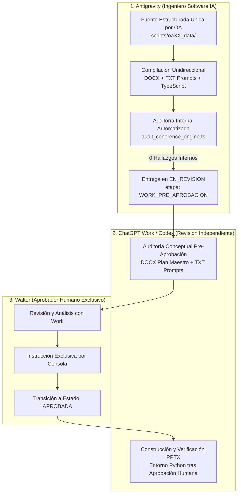

# Plan Universal de Producción, Auditoría y Gobernanza Pedagógica (3° a 8° Básico)
**Ecosistema Educativo EstudioSimple**
**Estado Normativo:** VIGENTE
**Zona Horaria de Registro:** `America/Santiago`

---

## 1. Misión, Marco y Principios Rectores

El presente **Plan Universal** establece las directrices de ingeniería pedagógica, desarrollo de software y aseguramiento de la calidad para todas las lecciones y paquetes curriculares de EstudioSimple entre **3° y 8° básico**.

Su objetivo es garantizar que cada Objetivo de Aprendizaje (OA) llegue a revisión técnica completo, isomórfico, determinista y alineado con los estándares del Ministerio de Educación de Chile (MINEDUC) y los Temarios Oficiales de Exámenes Libres (EELL).

---

## 2. Delimitación Estricta de Responsabilidades y Roles

El ciclo de vida de un paquete curricular involucra tres actores con fronteras y responsabilidades no intercambiables:



### 2.1. Antigravity (Ingeniero de Software con IA)
1. **Autoría en Fuente Única:** Diseña y mantiene el modelo de datos en la **fuente estructurada única** designada para cada OA (ej. `scripts/oa04_data/` para Matemática 7° OA04).
2. **Generación Unidireccional:** Compila de manera estrictamente unidireccional el Plan Maestro oficial en DOCX, el guion de prompts para Work en TXT y los módulos de lección en TypeScript. Queda prohibida la edición independiente de archivos derivados.
3. **Auditoría Interna Determinista:** Ejecuta el motor determinista de auditoría (`audit_coherence_engine.ts`) verificando las 15 reglas universales y la identidad de ejercicios en 5 dimensiones.
4. **Entrega Regulada:** El resultado de cero (0) hallazgos certifica **exclusivamente la auditoría interna**. Antigravity entrega el paquete en estado `EN_REVISION` con `"etapa_revision": "WORK_PRE_APROBACION"`.
5. **Límites Terminantes:** Antigravity **no genera ni modifica presentaciones PPTX finales**, no impone cronómetros acústicos de audio y **tiene terminantemente prohibido declarar `LISTA_PARA_APROBACION` o `APROBADA`** sin la intervención de Work y la instrucción de Walter.

### 2.2. ChatGPT Work / Codex (Revisión Independiente y Producción Visual)
El rol de Work/Codex se divide en dos fases rigurosamente secuenciales:
- **Fase 1: Pre-Aprobación (Auditor Independiente):**
  - Audita el flujo conceptual, la progresión didáctica, la redacción de notas al orador y la correspondencia entre la lección completa (DOCX) y los prompts de diapositivas (TXT).
  - En esta fase **el archivo PPTX aún no existe**, por lo que Work no valida presentaciones visuales finales sino la solidez pedagógica del plan maestro.
- **Fase 2: Post-Aprobación (Constructor y Verificador PPTX):**
  - Una vez que Walter aprueba formalmente el paquete, Work/Codex ejecuta en su entorno Python los scripts de maquetación 16:9 de diapositivas en PowerPoint (`.pptx`).
  - Inspecciona la renderización visual, capas vectoriales, tipografías y el logotipo blanco de EstudioSimple en la esquina inferior derecha.

### 2.3. Walter (Autoridad Máxima y Aprobador Humano Único)
- Walter es la única persona con potestad para aprobar formalmente una lección o un paquete de OA.
- Las auditorías de Antigravity y Work son insumos técnicos para Walter.
- Walter otorga la aprobación exclusivamente por consola tras analizar el paquete con ChatGPT Work.

---

## 3. Jerarquía y Organización por Alcance

Para evitar solapamientos y reglas espurias entre niveles, las especificaciones se organizan en 4 alcances estrictos:

```
┌─────────────────────────────────────────────────────────────┐
│ 1. ALCANCE UNIVERSAL (3° a 8° Básico - Este Plan Universal)  │
│    - 8 etapas duales (Mentor / Estudiante)                  │
│    - 6 lecciones completas por OA (Directriz Work)          │
│    - Fuente estructurada única por OA                        │
│    - Blindaje anti-texto en IA ('No text drawn by AI')      │
│    - Puente análogo-digital con cuaderno físico             │
│    - Identidad determinista de ejercicios (5 dimensiones)   │
│    - Reglas UNI-001 a UNI-015 como BLOQUEANTES              │
│    - Ciclo de 5 estados y trazabilidad America/Santiago     │
└──────────────────────────────┬──────────────────────────────┘
                               │
       ┌───────────────────────┴───────────────────────┐
       ▼                                               ▼
┌──────────────────────────────┐ ┌──────────────────────────────┐
│ 2. ALCANCE POR CURSO         │ │ 3. ALCANCE POR ASIGNATURA    │
│    (profiles/cursos/)        │ │    (profiles/asignaturas/)   │
│ - 7° Básico:                 │ │ - Matemática:                │
│   * 14 láminas bimodales     │ │   * Enfoque CPA (Concreto,   │
│     (7 Gancho + 7 Explic.)   │ │     Pictórico, Simbólico)    │
│   * 4 alternativas (A-D) con │ │   * Fórmulas p% = p ÷ 100    │
│     análisis distractores    │ │   * Subtítulos max 36 pt     │
│ - Otros cursos: adaptaciones │ │ - Ciencias Naturales:        │
│   evolutivas y andamiaje     │ │   * Indagación empírica      │
└──────────────────────────────┘ └──────────────────────────────┘
                               │
                               ▼
┌─────────────────────────────────────────────────────────────┐
│ 4. ALCANCE POR OA ESPECÍFICO                                │
│    - Progresión temática curricular (ej. OA04 Porcentajes)  │
│    - Mapeo exacto a Texto Escolar MINEDUC verificado        │
└──────────────────────────────┘
```

---

## 4. Reglas Universales Transversales (3° a 8° Básico)

Todas las reglas universales (`UNI-001` a `UNI-015`) se clasifican como **BLOQUEANTES**. Ningún paquete puede superar la auditoría interna si incumple cualquiera de ellas:

### UNI-001: Estructura Estandarizada por Lección
Cada lección se compone de dos módulos audiovisuales balanceados (Gancho motivacional y Explicación conceptual) estructurados según el perfil de curso aplicable.

### UNI-002: Locución Limpia y Fluida
Las notas al orador deben contener prosa pedagógica limpia, sin indicaciones técnicas de escenario ni acotaciones teatrales no verbalizables. La duración acústica real se verifica en Google Vids durante producción.

### UNI-003: Representación Humana Coherente
Los personajes protagonistas reflejan la edad evolutiva del curso (ej. estudiantes de 13 años para 7° básico) y mantienen vestimenta, características físicas y actitud de indagación activa constantes en toda la serie.

### UNI-004: Blindaje Terminante Anti-Texto en Arte IA
Todo prompt de generación de imagen para IA debe contener la directiva mandatoria:
`No text drawn by AI, no artificial typography, no random letters, no watermark, no logos on the background scene.`
La IA genera exclusivamente el arte y los personajes. Todo texto es añadido mediante capas vectoriales nativas.

### UNI-005: Coherencia Isomórfica en 5 Dimensiones (Diapositiva 6 = Práctica 1)
El caso modelado en la última lámina de contenido del video explicativo debe ser **estrictamente idéntico** al primer ejercicio de la práctica interactiva (`caso1`), compartiendo las 5 dimensiones de identidad:
1. **Contexto del ejercicio:** Mismo escenario, personajes y situación cotidiana.
2. **Datos y unidades:** Mismos valores numéricos, magnitudes, monedas y unidades de medida.
3. **Pregunta e intención:** Misma pregunta formulada y propósito didáctico.
4. **Procedimiento esperado:** Mismos pasos de modelamiento y resolución.
5. **Respuesta correcta y retroalimentación:** Mismo resultado exacto y explicación formativa del porqué.

### UNI-006: Evaluación Psicométrica Formal
La lección final de síntesis debe incorporar reactivos formales alineados al estándar psicométrico del MINEDUC para Exámenes Libres, con alternativas plausibles y justificación exhaustiva de cada distractor.

### UNI-007: Progresión Pedagógica en 6 Lecciones por OA
Se adopta como estándar normativo universal exactamente **6 lecciones completas por Objetivo de Aprendizaje (OA)** (según recomendación de ChatGPT Work):
- *Lección 1:* Activación y modelo concreto/pictórico.
- *Lección 2:* Formalización conceptual y representación simbólica.
- *Lección 3:* Estrategias cognitivas y cálculo mental/atajos.
- *Lección 4:* Algoritmos universales y resolución guiada de problemas.
- *Lección 5:* Aplicaciones cotidianas y toma de decisiones.
- *Lección 6:* Síntesis integradora, ensayo tipo Examen Libre y evaluación psicométrica.

### UNI-008: Puente Análogo-Digital con el Cuaderno Físico
Cada lección debe incorporar instrucciones explícitas para pausar el entorno digital y realizar trabajo manual reflexivo en el cuaderno físico (diagramas, desarrollo algebraico o mapas de síntesis).

### UNI-009: Reutilización Fiel en Comprobación Post-Video (`postQuestions`)
Las preguntas de comprobación posterior al video (Paso 6) deben reutilizar con identidad total en las 5 dimensiones los ejercicios de la práctica guiada (`caso1` y `caso2`). Queda estrictamente prohibido introducir variantes improvisadas o ejercicios no articulados en este chequeo inmediato.

### UNI-010: Cierre Teleológico con Regla de Oro y Pase Limpio a la Práctica
La lámina de cierre del video explicativo debe sintetizar la lección mediante la **Regla de Oro** y otorgar el pase limpio e inmediato a la plataforma interactiva:
`"Ahora pon a prueba lo aprendido resolviendo los casos de práctica en la plataforma interactiva."`
Queda prohibido introducir tareas no resueltas, preguntas abiertas de cierre o desafíos adicionales al finalizar el video.

### UNI-011: Integridad Completa de los 8 Pasos Didácticos
Cada lección en la plataforma debe contener desarrollados en su totalidad, sin bloques vacíos ni placeholders (`TODO`, `FIXME`, `lorem ipsum`), los 8 pasos: `metadata`, `prep`, `route`, `situation`, `hook`, `formalization`, `practice`, `mini` y `paso8_cierre` (con `preguntaSintesis`, `metacognicion` y `celebracion`).

### UNI-012: Atributos Estéticos Universales de Prompts Visuales
Todo prompt de ilustración debe especificar:
`Modern anime style 16:9 widescreen illustration. Two 13-year-old student explorers... clear negative space... No text drawn by AI.`

### UNI-013: Prohibición de Elementos Gráficos Simulados en Arte IA
Queda terminantemente prohibido instruir a la IA a dibujar logotipos, insignias, escudos o letras de alternativas (A, B, C, D) dentro de la ilustración.

### UNI-014: Honestidad Epistemológica y Cita Canónica
Todo marco disciplinar debe sustentarse en los Textos Escolares Oficiales del MINEDUC y las Bases Curriculares vigentes, citando editorial, unidad y páginas verificadas. Se prohíbe calificar de "oficial" reactivos elaborados por el equipo pedagógico.

### UNI-015: Fuente Estructurada Única y Compilación Unidireccional
Cada OA dispone de una **única fuente estructurada de datos** definida por el proyecto (ej. `scripts/oa04_data/` para MAT-OA04). DOCX, TXT de prompts y TypeScript se compilan o sincronizan exclusivamente en una sola dirección desde dicha fuente. Se prohíbe terminantemente la edición independiente de artefactos derivados.

---

## 5. Ciclo de Vida y Transición de Estados (5 Estados Formales)

Todo paquete curricular transita estrictamente por los siguientes 5 estados:

```
[BORRADOR] 
    │
    ▼
[EN_REVISION] ──(Falla auditoría interna)──► [REQUIERE_AJUSTES]
    │                                              │
    │ (Pasa auditoría interna con 0 hallazgos)     │ (Corregido en fuente única)
    ▼                                              ▼
[EN_REVISION (WORK_PRE_APROBACION)] ◄──────────────┘
    │
    │ (Revisión independiente por Work/Codex)
    ▼
[LISTA_PARA_APROBACION]
    │
    │ (Aprobación humana explícita por Walter en consola)
    ▼
[APROBADA]
```

1. **`BORRADOR`:** Paquete en elaboración en la fuente estructurada de datos.
2. **`EN_REVISION`:** Paquete compilado sometido a auditoría técnica. Antigravity lo etiqueta internamente con `"etapa_revision": "WORK_PRE_APROBACION"` una vez que la auditoría interna arroja 0 hallazgos.
3. **`REQUIERE_AJUSTES`:** Estado cuando la auditoría interna o la revisión de Work detectan hallazgos o discrepancias.
4. **`LISTA_PARA_APROBACION`:** Estado otorgado **únicamente después** de que ChatGPT Work/Codex concluye su auditoría independiente del contenido sin observaciones pendientes. Antigravity **no tiene autorización** para aplicar este estado de forma autónoma.
5. **`APROBADA`:** Estado final otorgado **exclusivamente por Walter** por consola tras la deliberación conjunta con Work.

---

## 6. Identidad Determinista de Ejercicios en 5 Dimensiones

Para erradicar discrepancias sutiles entre la explicación audiovisual y la práctica interactiva, se sustituye el simple cotejo de palabras clave por la **verificación de identidad determinista en 5 dimensiones**:

| Dimensión | Definición | Verificación Isomórfica |
| :--- | :--- | :--- |
| **1. Contexto** | Entorno, personajes y situación cotidiana del problema | Coincidencia en la situación problemática (`context`) |
| **2. Datos y Unidades** | Magnitudes, cantidades numéricas, divisas y porcentajes | Valores numéricos y unidades idénticos |
| **3. Pregunta e Intención** | Interrogante específica formulada y meta pedagógica | Coincidencia en la pregunta exacta (`question`) |
| **4. Procedimiento** | Algoritmo y pasos de resolución guiada | Pasos de modelamiento y resolución correspondientes |
| **5. Respuesta y Feedback** | Resultado exacto y retroalimentación formativa | Coincidencia en la respuesta correcta (`expected`) |

Los identificadores `caso1` y `caso2` deben enlazar de forma transparente:
- **`caso1`:** Modela en Lámina 6 del video ➔ Se resuelve en Práctica 1 (`practice[0]`) ➔ Se reutiliza en Comprobación Post-Video 1 (`postQuestions[0]`) ➔ Aparece en DOCX y TypeScript.
- **`caso2`:** Se resuelve en Práctica 2 (`practice[1]`) ➔ Se reutiliza en Comprobación Post-Video 2 (`postQuestions[1]`) ➔ Aparece en DOCX y TypeScript.

---

## 7. Trazabilidad Temporal y Control de Versiones

Todo artefacto generado (DOCX, TXT de prompts y `manifest.json`) debe incluir la fecha y hora exacta de compilación en zona horaria de Chile:
- **Formato:** `YYYY-MM-DD HH:mm [America/Santiago]` o ISO con offset local.
- Al generarse una nueva versión, se reemplaza el archivo anterior en su ruta canónica, registrando en el manifiesto el hash criptográfico SHA-256 de cada archivo.

---

## 8. Catálogo de Ejemplos Aprobados

- **Matemática 7° Básico OA01 (`110-7-MAT-OA01`):** Paquete preservado intacto como referencia canónica aprobada.
- **Ciencias Naturales 7° Básico OA01 (`110-7-CIE-OA01`):** Paquete certificado y versionado.
- **Matemática 7° Básico OA04 (`110-7-MAT-OA04`):** Permanece en `REQUIERE_AJUSTES` durante la fase de corrección y pasa a `EN_REVISION` (`WORK_PRE_APROBACION`) al completar la compilación con 0 hallazgos internos. Queda expresamente **excluido** del catálogo de ejemplos aprobados hasta contar con la aprobación formal de Walter.
