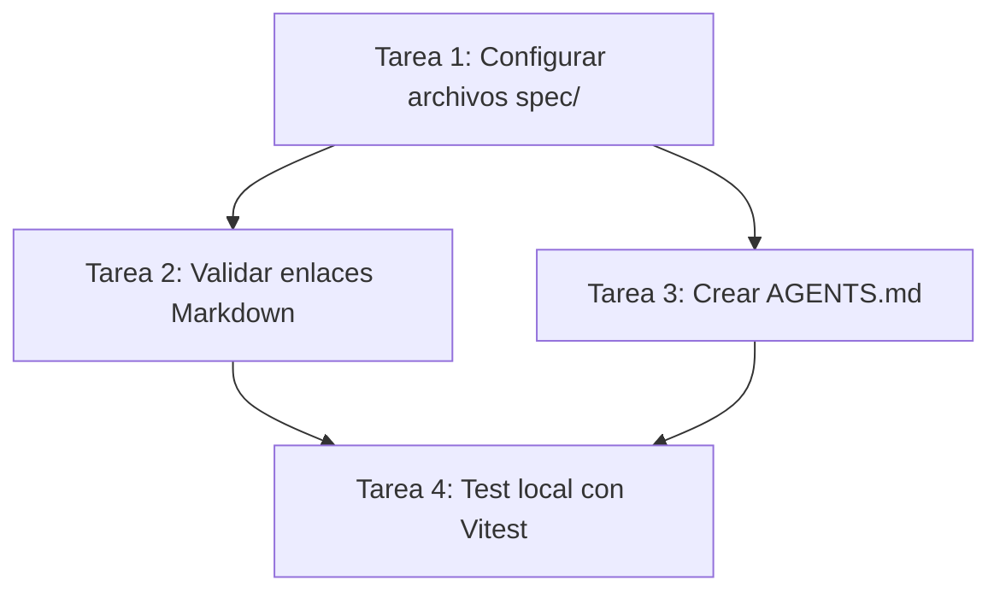

# Plan de Implementación: 001_initial_setup

## 🚀 Fases del Workflow (Grafo DAG)

## 📂 Dependencias y Archivos Afectados
- **Archivos a crear:** `AGENTS.md`, `spec/constitution/mission.md`, `spec/constitution/tech-stack.md`
- **Modificaciones de configuración:** Ninguna en esta fase.
- **Riesgo:** Conflicto de comandos de entorno con sistemas operativos locales.